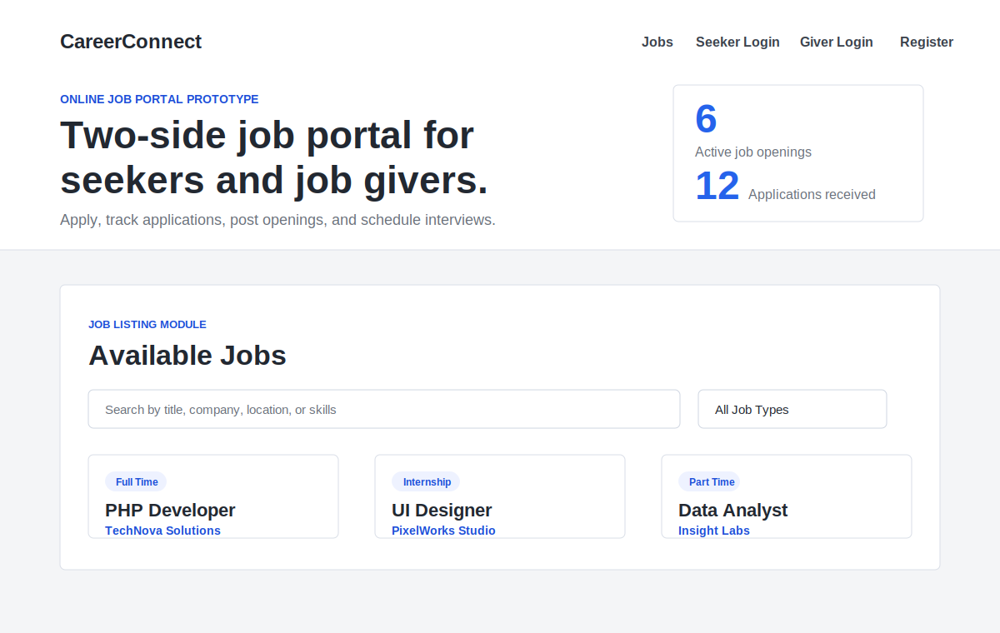
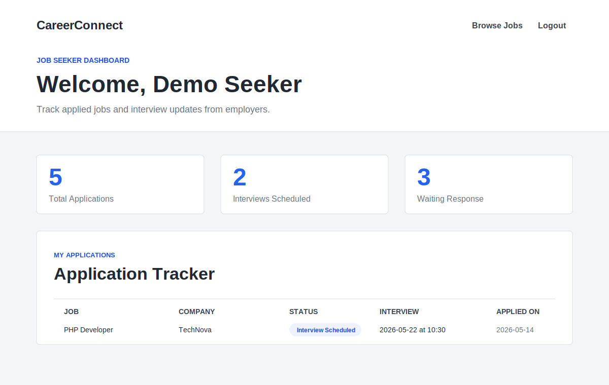
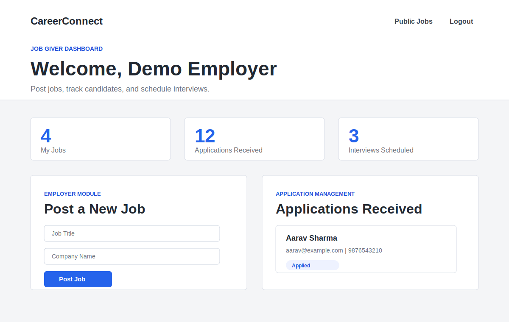

# Online Job Portal

A full-stack PHP and MySQL web application for managing job listings, applications, and role-based user dashboards. The project supports two user roles: job seekers and job givers.

## Features

- Role-based authentication for job seekers and job givers
- Job seeker registration and login
- Employer/job giver registration and login
- Public job listing page
- Job application submission
- Job seeker dashboard for tracking applications
- Job giver dashboard for posting and managing jobs
- Interview scheduling workflow
- MySQL database integration using PDO
- Responsive UI with custom CSS

## Tech Stack

- PHP
- MySQL
- HTML5
- CSS3
- JavaScript
- XAMPP / Apache
- PDO for database connection

## Screenshots

### Home Page



### Job Seeker Dashboard



### Job Giver Dashboard



## Project Structure

```text
online-job-portal/
+-- css/
|   +-- style.css
+-- js/
|   +-- script.js
+-- data/
|   +-- applications.json
|   +-- jobs.json
|   +-- users.json
+-- screenshots/
|   +-- home.svg
|   +-- seeker-dashboard.svg
|   +-- giver-dashboard.svg
+-- database.sql
+-- db.php
+-- functions.php
+-- index.php
+-- login.php
+-- register.php
+-- logout.php
+-- seeker_dashboard.php
+-- giver_dashboard.php
+-- DATABASE_SETUP.md
```

## Installation

1. Clone the repository:

```bash
git clone https://github.com/Frenik06/online-job-portal.git
```

2. Move the project into your XAMPP `htdocs` folder:

```text
C:\xampp\htdocs\online-job-portal
```

3. Start Apache and MySQL from the XAMPP Control Panel.

4. Import the database:

- Open MySQL Workbench or phpMyAdmin.
- Create/import using the provided `database.sql` file.
- The script creates the `careerconnect` database and required tables.

5. Update database settings in `db.php` if needed:

```php
define('DB_HOST', '127.0.0.1');
define('DB_NAME', 'careerconnect');
define('DB_USER', 'root');
define('DB_PASS', '');
```

6. Open the project in your browser:

```text
http://localhost/online-job-portal/
```

## Demo Accounts

### Job Seeker

```text
Email: seeker@example.com
Password: 123456
```

### Job Giver

```text
Email: giver@example.com
Password: 123456
```

## Main Pages

- `index.php` - Home page and job listings
- `login.php` - User login
- `register.php` - User registration
- `seeker_dashboard.php` - Job seeker dashboard
- `giver_dashboard.php` - Job giver dashboard
- `logout.php` - Logout handler

## Database

The application uses a MySQL database named:

```text
careerconnect
```

The database schema and demo records are included in:

```text
database.sql
```

## Security Notes

- Passwords should be hashed before using this project in production.
- Do not commit real database credentials.
- Runtime session files are ignored using `.gitignore`.
- Validate and sanitize all user input before production deployment.

## Future Improvements

- Password hashing and reset functionality
- Admin dashboard
- Resume upload support
- Email notifications
- Advanced job search and filtering
- Application status updates
- Deployment-ready environment configuration

## Author

Developed by [Frenik06](https://github.com/Frenik06)
